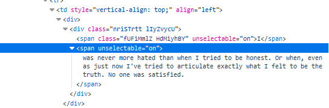

# type2fast
type2fast is a cheat for the game typeracer.

## Installation & Instructions  
```
$ git clone https://github.com/vsp0/type2fast.git
$ cd type2fast/
$ pip3 install -r requirements.txt
```

Now you'll have to install `chromedriver.exe`. Go to [this website](https://chromedriver.chromium.org/downloads) and install `chromedriver.exe` for your chrome version.

After this, place `chromedriver.exe` in the `type2fast` folder. When you run `main.py` you'll set the delay per word and it asks you to fill out the whole text.

To find the whole text, press `CTRL + SHIFT + I` to open developer tools. Now press `CTRL + SHIFT + C` to select an element. Now select the text, and you will hopefully see the same as I:



Just copy the text and paste it as the whole text with the first word which is not included in the text.

Now press enter to start, it will start to fill out the words!